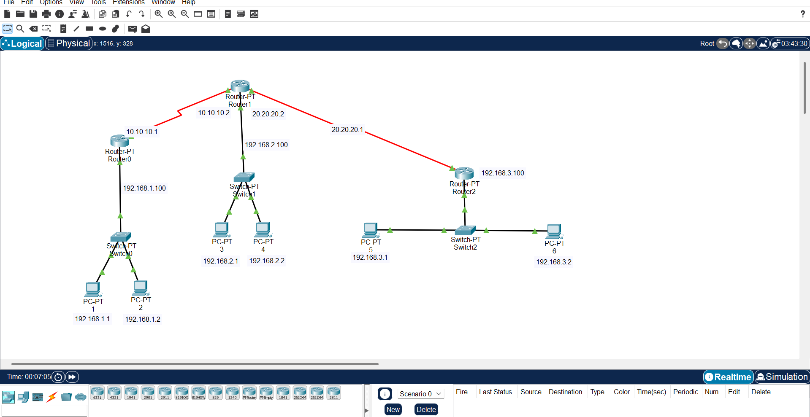

# Konfigurasi Static Routing dengan 3 Router di Cisco Packet Tracer

## 1. Pendahuluan
Static Routing adalah metode routing di mana administrator jaringan menentukan secara manual rute yang akan dilalui oleh paket data. Pada topologi ini digunakan 3 router yang saling terhubung untuk menghubungkan tiga network berbeda, sehingga setiap PC dapat saling berkomunikasi.

Dengan static routing, administrator harus menentukan next-hop atau alamat gateway router berikutnya secara manual untuk setiap jaringan yang ingin dicapai. Walaupun metode ini sederhana dan cocok untuk topologi kecil, kelemahannya adalah kurang fleksibel: jika ada perubahan pada jaringan, administrator harus mengedit konfigurasi secara manual di setiap router.

Tujuan dari praktikum ini adalah:
- Membuat topologi jaringan dengan 3 router.
→ Melatih pemahaman dalam membangun skema jaringan antar router.

- Mengkonfigurasi IP Address pada setiap interface router dan PC.
→ Supaya setiap perangkat dalam topologi dapat saling mengenali dan berkomunikasi.

- Menerapkan static routing agar semua jaringan dapat saling berkomunikasi.
→ Membuktikan bahwa static route dapat menghubungkan subnet berbeda melalui jalur yang sudah ditentukan.

- Melakukan uji konektivitas dengan perintah ping.
→ Sebagai validasi apakah konfigurasi sudah benar.
---

## 2. Topologi Jaringan
Berikut topologi jaringan yang digunakan:

Keterangan IP Address:
- **Router0**
  - FastEthernet0/0 : 192.168.1.100 /24
  - Serial2/0 : 10.10.10.1 /8  
- **Router1**
  - FastEthernet0/0 : 192.168.2.100 /24
  - Serial2/0 : 10.10.10.2 /8
  - Serial3/0 : 20.20.20.2 /8
- **Router2**
  - FastEthernet0/0 : 192.168.3.100 /24
  - Serial2/0 : 20.20.20.1 /8  

🔎 Analisa:
Topologi ini membagi jaringan menjadi 3 LAN berbeda: 192.168.1.0/24, 192.168.2.0/24, dan 192.168.3.0/24. Router1 berperan sebagai penghubung utama antara Router0 dan Router2.
---

## 3. Konfigurasi Router dan PC

### Router0
- Interface FastEthernet0/0  

→ Digunakan untuk menghubungkan Router0 dengan LAN1 (PC0 & PC1).

- Interface Serial2/0  

→ Menghubungkan Router0 dengan Router1.

### Router1
- Interface FastEthernet0/0  

→ Digunakan untuk menghubungkan Router1 dengan LAN2 (PC2 & PC3).

- Interface Serial2/0  

→ Koneksi serial ke Router0.

- Interface Serial3/0  

→ Koneksi serial ke Router2.

### Router2
- Interface FastEthernet0/0  

→ Digunakan untuk menghubungkan Router2 dengan LAN3 (PC4 & PC5).

- Interface Serial2/0  

→ Koneksi serial ke Router1.
---

### PC
Setiap PC dikonfigurasi dengan IP Address statis dan gateway sesuai router yang terhubung.
- PC0 : 192.168.1.1 /24  

- PC1 : 192.168.1.2 /24  

- PC2 : 192.168.2.1 /24  

- PC3 : 192.168.2.2 /24  

- PC4 : 192.168.3.1 /24  

- PC5 : 192.168.3.2 /24  

🔎 Analisa:
Dengan konfigurasi ini, setiap PC bisa mengakses router masing-masing. Namun, tanpa routing tambahan, PC hanya bisa berkomunikasi dalam LAN yang sama.
---

## 4. Konfigurasi Routing

### Router0 - Static Route

→ Router0 diberi route ke jaringan 192.168.2.0 dan 192.168.3.0 melalui alamat next-hop 10.10.10.2 (Router1).

### Router1 - RIP Routing

→ Router1 dikonfigurasi dengan RIP agar bisa bertukar informasi routing dengan router tetangga.

### Router1 - Static Route

→ Static route digunakan agar Router1 tahu jalur ke jaringan LAN lain jika RIP tidak dipakai.

### Router2 - RIP Routing

→ Router2 juga dikonfigurasi dengan RIP agar routing lebih otomatis.

### Router2 - Static Route

→ Static route untuk mengakses jaringan LAN1 dan LAN2 melalui Router1 (20.20.20.2).
 
🔎 Analisa: 
-Static routing → administrator atur manual.
-RIP → router bisa berbagi informasi otomatis.
---

## 5. Pengujian Koneksi (Ping Test)

- Ping PC0 ke PC1  

→ Hasilnya Reply, artinya komunikasi dalam LAN1 berhasil.

- Ping PC2 ke PC3  

→ Hasilnya Reply, artinya LAN2 terkoneksi dengan baik.

- Ping PC4 ke PC5  

→ Hasilnya Reply, LAN3 berfungsi dengan benar.

- Ping antar jaringan (PC1 ke PC4)  

→ Hasilnya Reply, membuktikan bahwa static routing antar-router berhasil.

🔎 Analisa:
-Komunikasi intra-LAN berhasil tanpa routing tambahan (cukup gateway).
-Komunikasi inter-LAN hanya berhasil setelah static route ditambahkan.
---

## 6. Kesimpulan
Dari hasil konfigurasi dan pengujian dapat disimpulkan bahwa:
1. Jaringan dengan 3 router dapat terhubung menggunakan static routing.
→ Karena setiap router diberi jalur manual untuk mengenali subnet lain.
2. RIP Routing juga dapat digunakan untuk mempermudah pertukaran routing antar router.
→ Namun untuk belajar dasar, static routing lebih mudah dipahami.
3. Semua PC dari network 192.168.1.0/24, 192.168.2.0/24, dan 192.168.3.0/24 dapat saling berkomunikasi.
→ Dibuktikan dengan uji ping antar host yang berhasil.
4. Pengujian ping berhasil menunjukkan bahwa topologi sudah berjalan dengan baik.
→ Artinya konfigurasi IP Address, gateway, dan routing sudah sesuai.

## DIBUAT OLEH
ANDI KURNIAWAN
