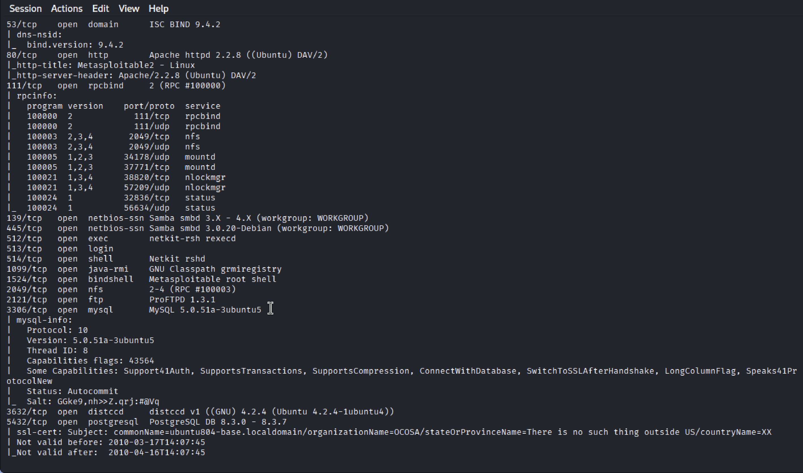

# 🛡️ Laporan Hasil Scanning Nmap --- Metasploitable2 (Enhanced Version)

## 📌 Informasi Target

-   **IP Address:** 192.168.100.10\
-   **Hostname:** target\
-   **Command:** `nmap -n -Pn -p- -A target -o hasil_scan.txt`

------------------------------------------------------------------------

# 🔍 Ringkasan Port Terbuka & Analisis Risiko

| Port    | Status | Layanan    | Deskripsi                                |
| ------- | ------ | ---------- | ---------------------------------------- |
| 21      | open   | FTP        | vsftpd 2.3.4 (anonymous login, backdoor) |
| 22      | open   | SSH        | OpenSSH 4.7p1 (algoritma lama)           |
| 23      | open   | Telnet     | Tidak terenkripsi                        |
| 25      | open   | SMTP       | Postfix, VRFY aktif                      |
| 53      | open   | DNS        | BIND 9.4.2                               |
| 80      | open   | HTTP       | Apache 2.2.8 + WebDAV                    |
| 111     | open   | RPCBind    | Pemetaan RPC                             |
| 139/445 | open   | SMB        | Samba 3.0.20 (signing off)               |
| 512–514 | open   | RServices  | rlogin, rexec, rsh (tidak aman)          |
| 1099    | open   | Java RMI   | Rentan RCE                               |
| 2049    | open   | NFS        | Dapat di-mount tanpa autentikasi         |
| 2121    | open   | ProFTPD    | Versi lama, RCE                          |
| 3306    | open   | MySQL      | root tanpa password                      |
| 3632    | open   | distccd    | Rentan remote shell                      |
| 5432    | open   | PostgreSQL | Versi lama                               |
| 5900    | open   | VNC        | Tidak terenkripsi                        |
| 6000    | open   | X11        | Akses GUI + keylogging                   |
| 6667    | open   | UnrealIRCd | Backdoor bawaan                          |
| 7001    | open   | JServ      | Rentan traversal                         |
| 8009    | open   | AJP13      | Rentan file inclusion                    |
| 8180    | open   | Tomcat     | Admin lemah                              |

------------------------------------------------------------------------

🔍 Analisis Kerentanan per Port (Versi Tabel)
Port	Layanan	Detail Kerentanan	Risiko
21	FTP (vsftpd 2.3.4)	Anonymous login + backdoor vulnerability	🔥 High
22	SSH	Versi lama, algoritma kunci lemah	⚠️ Medium
23	Telnet	Tidak dienkripsi, mudah disadap	🔥 High
25	SMTP (Postfix)	VRFY aktif, enumerasi user	⚠️ Medium
53	DNS (Bind 9.4.2)	Rentan cache poisoning, banyak CVE	⚠️ Medium
80	HTTP (Apache 2.2.8)	WebDAV aktif, celah upload shell & RCE	🔥 High
139/445	SMB (Samba 3.0.20)	SMB signing disabled, RCE (CVE-2007/2017)	🚨 Critical
512–514	RServices	Tidak aman, autentikasi host-based	🔥 High
1099	Java RMI	Rentan Remote Code Execution	🔥 High
2049	NFS	Bisa dimount tanpa autentikasi	🔥 High
2121	ProFTPD 1.3.1	Banyak celah RCE	🔥 High
3306	MySQL	root tanpa password	🚨 Critical
3632	distccd	Rentan dieksploitasi untuk remote shell	🔥 High
5432	PostgreSQL	Versi lama, mudah brute-force	⚠️ Medium
5900	VNC	Tidak terenkripsi, rentan brute-force	🔥 High
6000	X11	Screenshot, keylogging tanpa autentikasi	🔥 High
6667	UnrealIRCd	Backdoor bawaan, RCE	🚨 Critical
7001	Apache JServ	Rentan directory traversal	⚠️ Medium
8009	AJP13	Rentan file inclusion, upload webshell	🔥 High
8180	Tomcat	Login admin lemah, upload WAR shell	🔥 High
# 🧨 Kerentanan Paling Kritis

## 1. Remote Code Execution (RCE)

Sumber kerentanan: - Samba 3.0.20\
- distccd\
- UnrealIRCD Backdoor\
- ProFTPD 1.3.1

**Dampak:** Penyerang dapat eksekusi perintah sebagai root.

------------------------------------------------------------------------

## 2. Credential Leak

-   FTP Anonymous Access\
-   Telnet\
-   RSH (rlogin, rshell)

**Dampak:** Login tanpa autentikasi.

------------------------------------------------------------------------

## 3. Web Exploitation

-   Apache 2.2.8\
-   Tomcat 5.5

**Dampak:** Upload shell → akses penuh webserver.

------------------------------------------------------------------------

## 4. Outdated Services

Hampir semua layanan menggunakan versi 2007--2010 dan memiliki eksploit
publik.

------------------------------------------------------------------------

# 📊 Tabel Risiko

  ---------------------------------------------------------------------------
  No      Risiko         Layanan Terdampak                  Dampak
  ------- -------------- ---------------------------------- -----------------
  1       Remote Code    Samba, distccd, ProFTPD            Full compromise
          Execution                                         

  2       Credential     FTP, Telnet, RSH                   Pengambilalihan
          Leak                                              akun

  3       Web Exploit    Apache, Tomcat                     Upload shell

  4       Enumeration    NFS, MySQL, RPC                    Pivoting

  5       Outdated       Semua                              Eksploit publik
          Service                                           tersedia
  ---------------------------------------------------------------------------

------------------------------------------------------------------------

# 📝 Kesimpulan

Metasploitable2 pada IP **192.168.100.10** memiliki lebih dari **30 port
terbuka** dan hampir seluruh service rentan. Ini ideal untuk latihan
penetration testing, namun dalam konteks dunia nyata sistem seperti ini
**sangat berbahaya** dan dapat diambil alih dalam hitungan menit.

------------------------------------------------------------------------

# 📁 Lampiran

Semua hasil scanning direkomendasikan untuk: - Disimpan dalam folder
`/hasil_scan_nmap/` - Diupload ke GitHub - Disertai screenshot terminal
& nmap output

# dibuat oleh Serka Bek Andi Kurniawan
