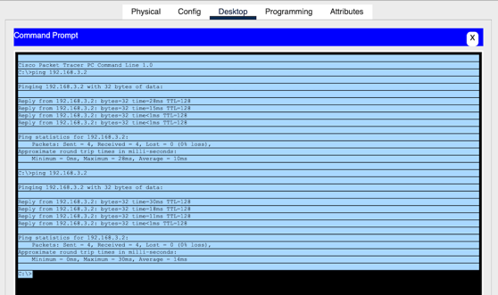
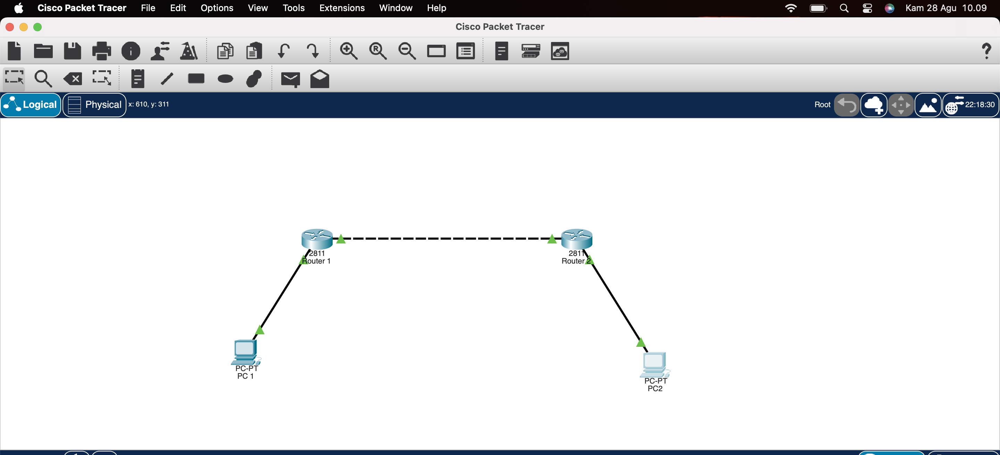

[Laporan_Routing_Statis.md](https://github.com/user-attachments/files/22040561/Laporan_Routing_Statis.md)
# Konfigurasi Routing Statis dengan 2 Router dan 2 PC pada Cisco Packet Tracer

## 🔹 Topologi Jaringan
[Topologi](gambar1.png)

---

## 🔹 Konfigurasi IP Address  
**PC1**  
- IP: 192.168.1.2  
- Subnet Mask: 255.255.255.0  
- Gateway: 192.168.1.1  

**R1**  
- FastEthernet0/0 → 192.168.1.1/24  
- FastEthernet0/1 → 192.168.2.1/24  

**R2**  
- FastEthernet0/0 → 192.168.2.2/24  
- FastEthernet0/1 → 192.168.3.1/24  

**PC2**  
- IP: 192.168.3.2  
- Subnet Mask: 255.255.255.0  
- Gateway: 192.168.3.1  

---

## 🔹 Konfigurasi Routing Statis  
**Router 1 (R1):**
```
conf t
int fa0/0
 ip address 192.168.1.1 255.255.255.0
 no shut
int fa0/1
 ip address 192.168.2.1 255.255.255.0
 no shut
ip route 192.168.3.0 255.255.255.0 192.168.2.2
end
```

**Router 2 (R2):**
```
conf t
int fa0/0
 ip address 192.168.2.2 255.255.255.0
 no shut
int fa0/1
 ip address 192.168.3.1 255.255.255.0
 no shut
ip route 192.168.1.0 255.255.255.0 192.168.2.1
end
```

---

## 🔹 Hasil Uji Coba  

**Ping dari PC1 ke PC2**  


**Ping dari PC2 ke PC1**  


**Traceroute** (opsional jika dilakukan)  


---

## 🔹 Analisa  
- Routing statis berhasil membuat PC1 (192.168.1.2) dapat berkomunikasi dengan PC2 (192.168.3.2) melewati dua router (R1 dan R2).  
- Setiap router hanya tahu jaringan langsung + static route yang ditambahkan.  
- Tanpa routing statis, komunikasi antar subnet berbeda tidak mungkin dilakukan.  

---

## 🔹 Kesimpulan  
Dengan konfigurasi routing statis, dua jaringan berbeda dapat saling berkomunikasi melalui router. Routing statis mudah dikonfigurasi, tetapi tidak fleksibel untuk jaringan besar karena setiap perubahan jaringan harus diinput manual.

## 🔹 Dibuat oleh :
ANDI KURNIAWAN
