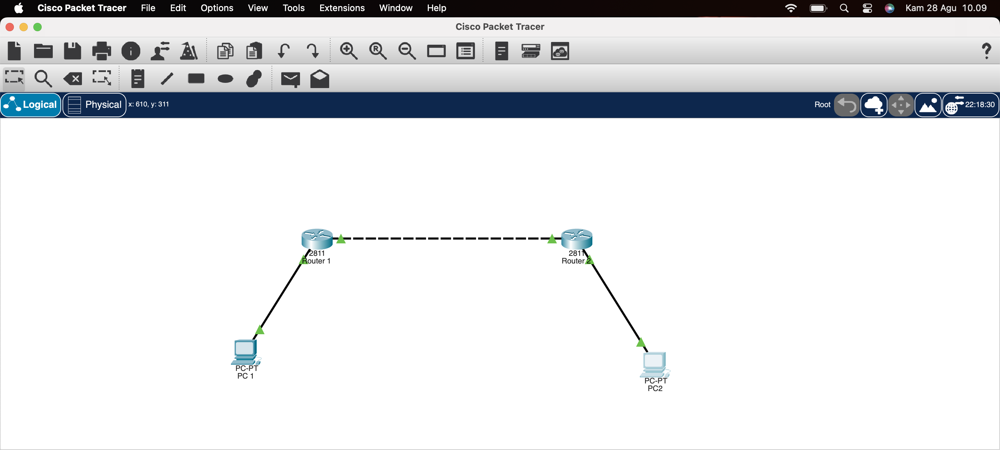
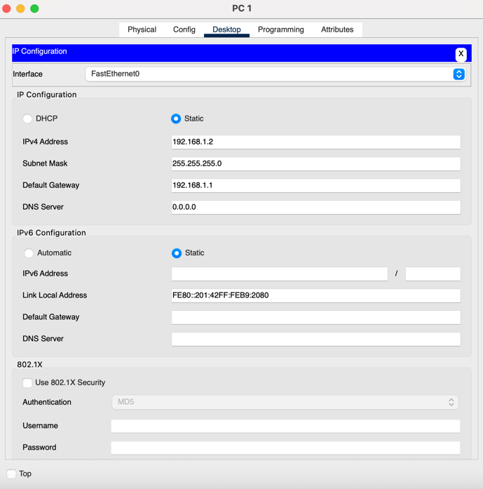
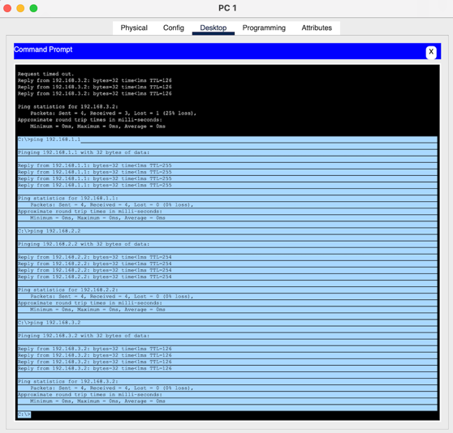
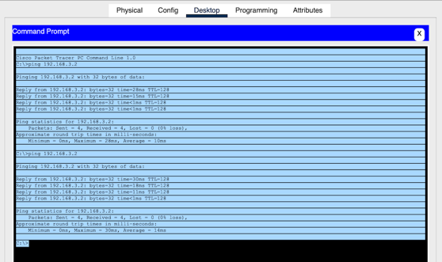
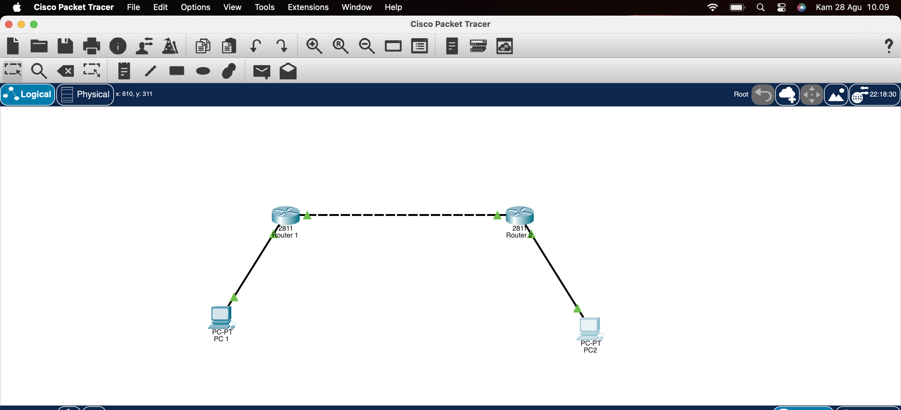

[README.md](https://github.com/user-attachments/files/22040958/README.md)
# Laporan Routing Statis dengan 2 Router
## Pendahuluan
Routing merupakan proses pengiriman paket data dari suatu jaringan ke jaringan lain melalui perangkat router. Pada dasarnya, routing terbagi menjadi dua, yaitu routing statis dan routing dinamis. Routing statis dilakukan dengan cara memasukkan rute secara manual oleh administrator, sedangkan routing dinamis menggunakan protokol routing untuk mempelajari jalur secara otomatis.

Pada praktikum ini digunakan topologi sederhana yang terdiri dari dua buah router dan dua buah PC. Tujuan utama adalah membuktikan bahwa dua host yang berada pada jaringan berbeda dapat saling berkomunikasi menggunakan konfigurasi routing statis pada router.

## Topologi Jaringan
Berikut adalah topologi jaringan yang digunakan pada simulasi routing statis menggunakan Cisco Packet Tracer :
## LAN 1 :
192.168.1.0/24 → PC1 (192.168.1.2) dengan gateway 192.168.1.1
## LAN 2 :
192.168.3.0/24 → PC2 (192.168.3.2) dengan gateway 192.168.3.1
## Link Antar-Router
192.168.2.0/24 → R1 (192.168.2.1) dan R2 (192.168.2.2)
Secara fisik, koneksi adalah:
PC1 ↔ R1 ↔ R2 ↔ PC2

---

## Konfigurasi PC
### PC 1
- IP Address: `192.168.1.2`
- Subnet Mask: `255.255.255.0`
- Default Gateway: `192.168.1.1`

### PC 2
- IP Address: `192.168.3.2`
- Subnet Mask: `255.255.255.0`
- Default Gateway: `192.168.3.1`

---

## Konfigurasi Router

### Router 1 (R1)
- FastEthernet 0/0: `192.168.1.1/24`
- FastEthernet 0/1: `192.168.2.1/24`
- Static Route: `192.168.3.0/24 via 192.168.2.2`

### Router 2 (R2)
- FastEthernet 0/0: `192.168.3.1/24`
- FastEthernet 0/1: `192.168.2.2/24`
- Static Route: `192.168.1.0/24 via 192.168.2.1`

---

## Pengujian Koneksi

### Ping dari PC1 ke PC2
Hasil pengujian ping dari PC1 ke PC2 berhasil dengan respon yang baik.

### Ping dari PC2 ke PC1
Hasil pengujian ping dari PC2 ke PC1 berhasil tanpa packet loss.

### Traceroute
Traceroute dari PC1 ke PC2 menunjukkan jalur komunikasi melalui kedua router.

## Analisa
Berdasarkan hasil uji coba, dapat dianalisis bahwa konfigurasi routing statis memungkinkan host pada jaringan yang berbeda untuk berkomunikasi dengan lancar. Router berfungsi sebagai perangkat yang meneruskan paket data berdasarkan alamat tujuan IP.

Dalam proses ini, IP sumber (192.168.1.2) dan IP tujuan (192.168.3.2) tetap sama dari ujung ke ujung. Router hanya mengganti alamat MAC address sesuai link berikutnya dan mengurangi nilai TTL setiap kali paket melewati router. Hal ini menunjukkan bahwa tidak ada perubahan IP end-to-end karena NAT tidak digunakan.

Routing statis sangat sederhana dan mudah dipahami, sehingga cocok untuk pembelajaran dasar. Namun, pada jaringan yang lebih besar, routing statis memiliki keterbatasan karena setiap perubahan topologi harus diperbarui secara manual. Oleh sebab itu, pada skala jaringan luas biasanya digunakan routing dinamis (misalnya RIP, OSPF, atau EIGRP).

## Kesimpulan
- Routing statis berhasil diterapkan menggunakan 2 router.  
- PC1 dan PC2 yang berada pada jaringan berbeda dapat saling berkomunikasi melalui static routing.  
- Dengan konfigurasi ini, komunikasi data berjalan lancar dan stabil.

## Dibuat Oleh
ANDI KURNIAWAN
